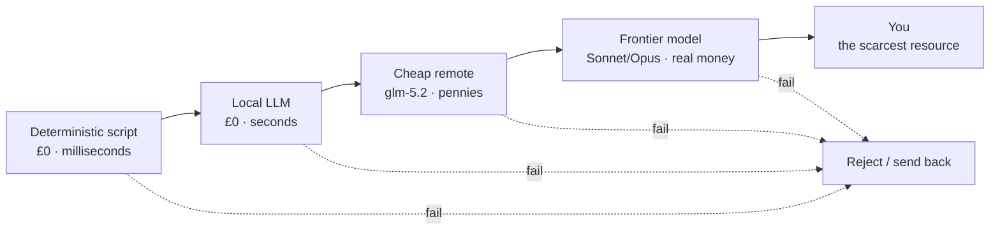
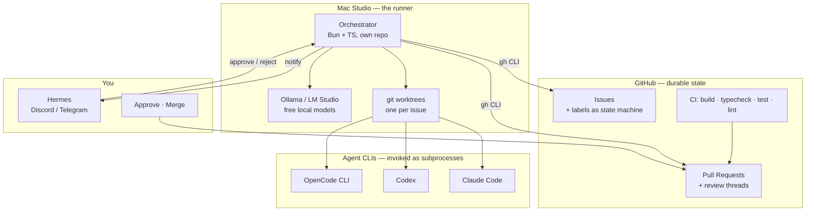
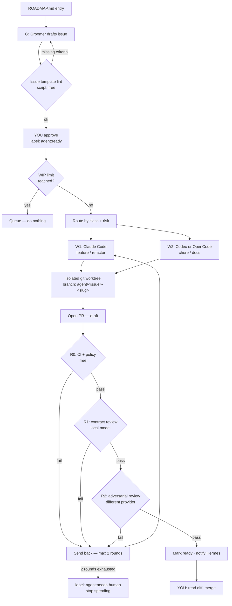
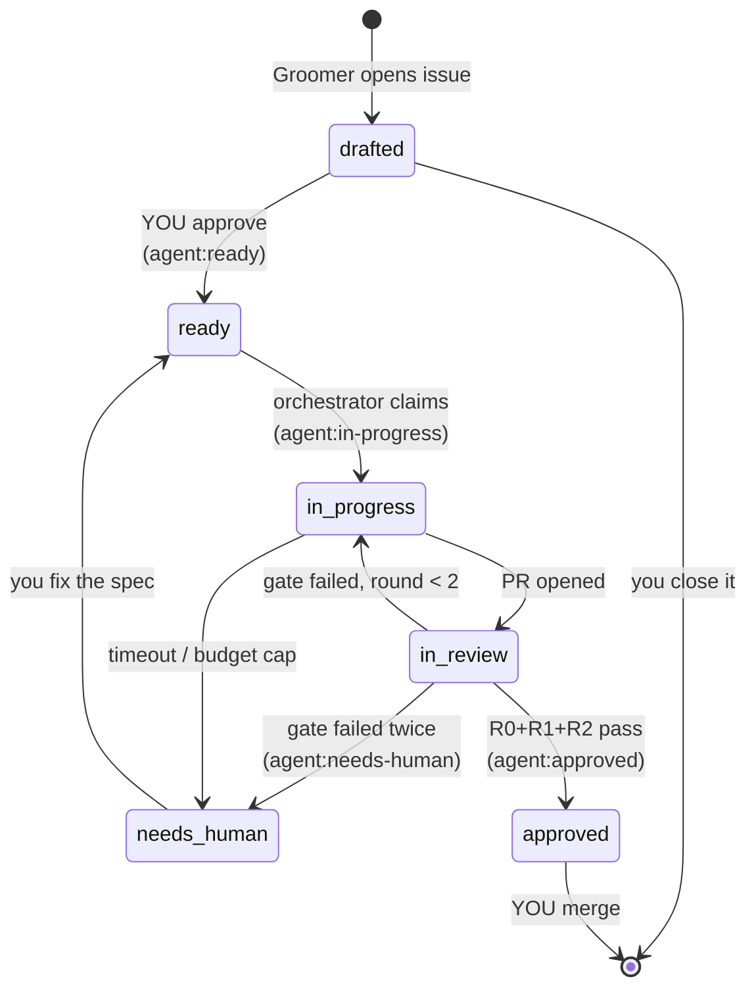
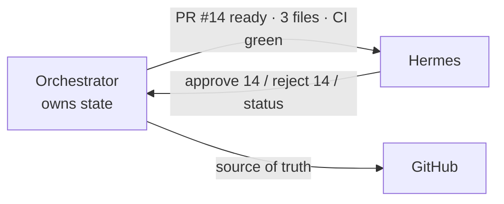
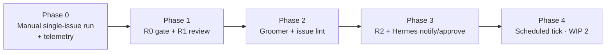

# Agent Pipeline — Proposal

_A semi-autonomous roadmap → issue → PR → review loop for LLAAB, designed to be cheap._

This document is for **you**. It explains the design, the reasoning, and the trade-offs.
The companion document (`PROMPT_AGENT_PIPELINE_SETUP.md`) is the build brief for an agent.

---

## Assumptions (correct me if wrong)

- LLAAB is hosted on GitHub, and you have the `gh` CLI authenticated.
- The Mac Studio is effectively always on and is where Ollama / LM Studio live.
- You are the only human in the loop. There is no team to distribute review across.
- "Cheap" means: minimise paid tokens per merged PR, not minimise wall-clock time.

---

## 1. The one idea that makes this work

Most multi-agent setups fail for the same reason: **they spend expensive tokens on work that a
free check could have rejected.** A model reviews a PR that doesn't compile. A worker implements
an issue that was never well-specified. A reviewer re-reads the whole repo to check a 40-line diff.

The design principle here is **cost-ordered gating**: at every stage, the cheapest possible check
runs first, and nothing more expensive runs until the cheaper gate passes.

Read that ladder right to left and it's also a **scarcity ordering**. Your attention is the most
expensive thing in the system, so the whole pipeline exists to make sure that by the time something
reaches you, three cheaper judges have already agreed it's worth looking at.

A corollary that matters more than it sounds: **a large fraction of "review" is not an LLM job at
all.** Typecheck, tests, lint, diff size, forbidden paths, conventional-commit format, "did they
touch `vault/`" — all deterministic, all free, all more reliable than a model. Build those first.
If you only ever build the deterministic gate and one worker, you will already have most of the
value.

---

## 2. Topology — what runs where

Three deliberate choices here:

**GitHub is the database.** Issues, labels, PRs, and review comments already give you durable state,
history, a queryable API, and a UI on your phone. Do not build a bespoke state store. Labels are
the state machine.

**The orchestrator is a separate repo, not part of LLAAB.** This matters more than it looks. If the
pipeline lives inside LLAAB and imports `@llaab/llm`, then a broken LLAAB breaks the pipeline that
was supposed to fix LLAAB. It also means agents working on LLAAB can edit the thing supervising
them. Keep it out: a standalone `agent-pipeline` repo with a per-target-repo config file. Bonus —
you can point it at `zshrc-config` later for free.

**CI is the primary gate, models are secondary.** The orchestrator never merges. It never even
asks a model for an opinion until CI is green.

---

## 3. The roster

Five agents plus you. Two do work, three judge it, and only one of the judges is expensive.

| # | Agent | Job | Runs on | Cost |
|---|-------|-----|---------|------|
| **G** | Groomer | Turn a `ROADMAP.md` entry into a well-formed issue draft | glm-5.2 via OpenCode | pennies |
| **W1** | Implementer (primary) | Write the code for feature/refactor issues | Claude Code — Sonnet 5, Opus on `risk:high` | the real spend |
| **W2** | Implementer (chore) | Docs, renames, TODO→DONE graduation, dep bumps, mechanical sweeps | Codex **or** OpenCode glm-5.2 | cheap |
| **R0** | Gatekeeper | Deterministic policy + CI status. No LLM. | pure script | free |
| **R1** | Contract reviewer | Does this diff satisfy the issue's acceptance criteria? Diff-only context. | gpt-oss:20b locally, glm-5.2 if the diff is large | free → pennies |
| **R2** | Adversarial reviewer | Hunt for LLAAB-specific landmines. Only runs if R0 and R1 pass. | Claude Code or Codex — **must differ from W1's provider** | moderate |
| **H** | You | Approve issues into the queue. Merge PRs. | — | scarce |

Two rules about the reviewers that are easy to skip and expensive to skip:

1. **R2 must not be the same model family as W1.** A model reviewing its own output is a
   rubber stamp. If W1 ran Claude Code, R2 runs Codex, and vice versa. Provider diversity is the
   cheapest way to buy independent judgement.
2. **Reviewers see the diff and the issue. Nothing else.** Not the worker's reasoning, not its
   plan, not its self-assessment. A reviewer that reads "I've carefully verified this works" will
   believe it.

### What R2 is actually looking for

Generic "review this code" prompts produce generic slop. R2 gets a **repo-specific landmine list**
derived from your own handoff doc — that's what makes it worth paying for:

- Process-state invariant: status derived from `useRunMonitor`, never a mutation's `isPending`
- No hardcoded `refetchInterval` overrides; no invalidate-on-every-poll-tick
- Public API drift in `@llaab/llm` (`routeLlm` / `streamLlm` / `getLlmStatus`)
- Writes into the nested `vault/` repo, or anything committed into it
- TS7 stale-`dist` workarounds — a "fix" in a consumer package that's really a build-order bug
- Tests weakened or deleted to go green
- Promotion logic that runs Git, or approval gates removed

That list lives in the pipeline config and grows every time something slips through. It is the
institutional memory of the system.

---

## 4. The flow

The two throttles in that diagram are the whole cost-control story:

- **WIP limit.** Start at **one** in-flight issue. Not two. One. A pipeline that produces PRs faster
  than you merge them is a machine for generating merge conflicts and stale branches.
- **Two fix rounds, then stop.** If a PR fails review twice, the issue was probably underspecified.
  Escalating to a human is cheaper than a third attempt, and far cheaper than the fourth.

---

## 5. State machine

Labels are the state. Nothing else tracks status.

Note what only *you* can do: move `drafted → ready`, and move `approved → merged`. Everything
between those two is automated. That's the whole trust boundary, and it's a good one to start with —
the groomer can't invent work for itself, and no agent can land code.

---

## 6. Routing — right agent, right effort

Two labels decide everything: **class** (what kind of work) and **risk** (how bad if it's wrong).

| class | risk | Worker | Model / effort | Max rounds | Reviewers |
|-------|------|--------|----------------|-----------:|-----------|
| `chore` | low | W2 | glm-5.2, light | 1 | R0 only |
| `docs` | low | W2 | glm-5.2, light | 1 | R0 + R1 |
| `test` | low | W2 | Codex, standard | 2 | R0 + R1 |
| `refactor` | med | W1 | Sonnet 5, standard | 2 | R0 + R1 + R2 |
| `feature` | med | W1 | Sonnet 5, standard | 2 | R0 + R1 + R2 |
| `refactor`/`feature` | high | W1 | Opus 4.8, deep | 2 | R0 + R1 + R2 + mandatory human read of the plan **before** implementation |
| anything touching `packages/llm` public API | high | W1 | Opus 4.8, deep | 1 | full ladder + you |

**Effort profiles** (the "effort level" you asked about):

| Profile | Extended thinking | Plan-before-code | Context budget | Use for |
|---------|-------------------|------------------|----------------|---------|
| `light` | off | no | issue + named files only | chores, docs |
| `standard` | on, moderate | yes, in the PR body | issue + touched package | most work |
| `deep` | on, high | yes, **posted to the issue for your approval first** | issue + package + dependents | high risk, API changes |

The `deep` profile's plan-first gate is the single highest-leverage cost control in the table. A
wrong plan costs you one cheap plan-generation call to discover. A wrong implementation costs the
whole session plus review plus your time.

---

## 7. Where local models genuinely help (and where they don't)

Being honest about this matters, because "use local models to save money" quietly becomes "produce
garbage for free" if applied to the wrong stages.

| Task | Local viable? | Which | Why |
|------|---------------|-------|-----|
| Classify an issue → class + risk labels | ✅ yes | `gemma4:e4b-it-qat` (JSON mode) | Small closed-set classification. Ideal local work. |
| Lint an issue against the template | ✅ yes — or no LLM at all | script first, `gemma4:e4b` fallback | Mostly a regex job |
| Summarise a diff for the PR body | ✅ yes | `gpt-oss:20b` | Summarisation degrades gracefully |
| R1 contract review of a small diff | ✅ yes | `gpt-oss:20b` (has function/tool support) | Checklist-shaped, diff-only, 131K context is plenty |
| Draft a conventional-commit message | ✅ yes | `gemma4:e4b-it-qat` | Trivial |
| Triage CI failure → is this flaky or real? | ⚠️ marginal | `gemma4:26b-a4b-it-qat` | Try it; measure |
| R2 adversarial review | ❌ no | — | Needs real judgement about consequences |
| Implementation | ❌ no | — | This is where quality compounds |
| Anything touching the `@llaab/llm` contract | ❌ no | — | Highest blast radius in the repo |

Your local fleet is well-suited to this: everything has JSON mode, `gpt-oss:20b` is the one with
function-calling, and the 131K–262K context windows mean diff-scoped review never needs truncation.
Local calls are free, so **run them liberally as pre-filters** — a local model that catches one in
four bad PRs before R2 sees them has paid for itself infinitely.

---

## 8. Is Hermes the right tool?

Partly — and the distinction is worth being precise about, because using it for the wrong half will
cost you a lot of debugging.

**Hermes is a control surface, not an orchestrator.** It's excellent at: pinging you when a PR is
ready, letting you approve an issue from your phone, kicking off a run, tailing a log, answering
"what's in flight?". Its MCP tools are already scoped to the LLAAB repo and vault and its inbox
writes are deterministic — good properties for a command surface.

**It is not** a state machine, a queue, a scheduler, or a place to hold branch state. Discord and
Telegram are lossy, unordered, and rate-limited. If a notification drops, GitHub still knows the
truth; if your queue lives in a Discord thread, it doesn't.

So: build the orchestrator standalone, and bolt Hermes on in Phase 3 as notification plus a handful
of commands. Don't start there.

---

## 9. Guardrails

Non-negotiable from day one, because every one of these represents a way to lose money or a
weekend:

- **Budget caps** — per-issue token/spend ceiling and a daily ceiling. On breach: abort, label
  `agent:needs-human`, notify. Hard stop, not a warning.
- **WIP limit** — start at 1.
- **Worktree isolation** — one worktree per issue, one branch per issue, agents never work in your
  main checkout, agents never touch each other's branches.
- **Forbidden paths** — `vault/`, `knowledge/`, `.agents/`, `~/Library/LaunchAgents/*`,
  `scripts/macos/*`, `configs/llm-routing.json`. Enforced by R0 as a hard diff check, not a prompt
  instruction. Prompts are advisory; scripts are not.
- **No merge authority** — the orchestrator's GitHub token should not be able to merge or push to
  `main`. Enforce it at the token, not in code.
- **No history rewriting** — no rebase of pushed branches, no force-push, ever.
- **Kill switch** — one command that stops all in-flight agents and releases their claims.
- **Telemetry from day one** — see below.

---

## 10. Cost model, and why you should distrust my numbers

Rough order of magnitude per merged PR, assuming diff-scoped review and prompt caching:

| Stage | Typical input | Typical output | Model | Order of cost |
|-------|--------------:|---------------:|-------|--------------|
| Groom | ~5–15K | ~1K | glm-5.2 | fractions of a cent |
| Implement (chore) | ~20–60K | ~3–8K | glm-5.2 / Codex | cents |
| Implement (feature) | ~150–500K | ~10–30K | Sonnet 5 | the dominant line item |
| R0 gate | — | — | script | zero |
| R1 contract | ~8–25K | ~1K | local | zero |
| R2 adversarial | ~15–40K | ~2–4K | Sonnet/Codex | cents |

These are estimates and you should treat them as such. Which is exactly why the build brief makes
**per-stage token and cost logging a Phase 0 requirement, not a nice-to-have.** After ten merged
PRs you'll have real numbers, and the routing table above becomes something you tune with evidence
instead of something I guessed at. If any single line surprises you, that's the line to optimise —
and it will almost certainly be implementation input tokens, which is a context-scoping problem, not
a model-choice problem.

Two cheap wins available immediately: prompt caching on any repeated context (a 90% input discount
on cache hits is enormous when every worker run re-reads the same handoff doc), and never handing a
worker more of the repo than the issue names.

---

## 11. Phased rollout

Each phase is independently useful. Stop at any point and you still have something working.

- **Phase 0 — walking skeleton.** You run `pipeline run <issue>`. It creates a worktree, invokes
  Claude Code with a scoped brief, opens a draft PR, logs tokens and cost. No reviewers, no
  automation. Goal: prove the loop and collect real cost data.
- **Phase 1 — the free gate.** R0 (CI + policy script) and R1 (local contract review). This is
  where most of the value lands, for almost no money.
- **Phase 2 — supply side.** Groomer reads `ROADMAP.md#next`, drafts issues, template lint rejects
  bad ones. You approve into `agent:ready`.
- **Phase 3 — judgement and mobility.** R2 adversarial review with provider diversity; Hermes
  notifications and phone approval.
- **Phase 4 — let it run.** Scheduled tick via launchd, WIP limit to 2, only once Phases 0–3 have
  been boring for a couple of weeks.

Do not skip Phase 0 to get to the interesting part. The interesting part is only safe because of
the numbers Phase 0 gives you.

---

## 12. Decisions I need from you

1. **GitHub confirmed?** If LLAAB is anywhere else, the substrate changes (though the shape doesn't).
2. **W2's runtime** — Codex or OpenCode glm-5.2 for chore work? Codex gives you provider diversity
   for free, which R2 wants anyway. Slight lean: Codex.
3. **Does the groomer open issues directly, or write drafts to a file for you to open?** Direct is
   more useful; file-based is safer for the first fortnight. Lean: direct, but the `agent:ready`
   approval gate makes either safe.
4. **Anthropic key in LLAAB** — your `/llm` page shows `claude-sonnet-4-6` as "provider API key not
   configured". Unrelated to this pipeline (which calls Claude Code as a subprocess, not the API),
   but worth deciding whether the app itself should have that route.
5. **Where does the pipeline repo live** — new `finografic/agent-pipeline`, or `tools/` inside
   something existing? Strong recommendation: its own repo.

---

## 13. Failure modes to expect

Not hypotheticals — these are the ones that will actually happen:

- **Issue quality collapse.** The groomer writes plausible issues with vague acceptance criteria;
  workers produce plausible PRs that don't do anything. *Mitigation:* the template lint is strict
  about testable acceptance criteria, and you keep the `agent:ready` gate.
- **Reviewer sycophancy.** R1/R2 approve everything. *Mitigation:* provider diversity, diff-only
  context, and periodically feed a known-bad PR through to check the gate still bites.
- **Scope creep in PRs.** Worker "helpfully" fixes adjacent things; diffs balloon; you stop
  reviewing carefully. *Mitigation:* R0 rejects diffs over a line-count threshold outright.
- **Stale branch pileup.** Four open agent PRs, all conflicting. *Mitigation:* WIP limit of 1.
- **Silent budget burn.** A worker loops on a failing test for an hour. *Mitigation:* hard per-issue
  cap and a max-rounds counter.
- **The pipeline becomes the project.** You spend three weekends on the orchestrator instead of on
  LLAAB. *Mitigation:* Phase 0 should be a few hundred lines. If it isn't, cut scope.
